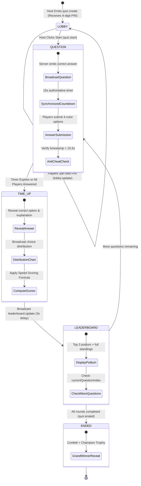

# 🧠 Real-Time Multiplayer Live Quiz Battle (Socket.io)

**Student Name:** Prince Yadav  
**Student ID / Enrollment:** 150096725032  
**Track:** Backend & Real-Time Web  
**Tech Stack:** Node.js, Express.js, Socket.io (4.x), In-Memory Game State Engine, CORS, Web Audio API  

---

## 📌 1. Project Overview & Architecture

This project delivers a high-stakes, interactive **Real-Time Multiplayer Trivia & Quiz Battle Arena** (similar to Kahoot / Quizizz) built using **Node.js**, **Express.js**, and **Socket.io**.

The system features an **authoritative backend game engine** that synchronizes question countdown clocks across all connected participants, validates player submissions with speed-based score bonuses, prevents cheating, and broadcasts live dynamic leaderboards round-by-round.

### 🌟 Core Capabilities
- **Authoritative In-Memory Game Engine**: State machine (`LOBBY` ➔ `QUESTION` ➔ `TIME_UP` ➔ `LEADERBOARD` ➔ `ENDED`) managing synchronized rounds without client-side clock drift.
- **PIN-Based Multi-Room Management**: Dynamic 4-digit numeric room PIN generation, room isolation, and live player roster broadcasting (`lobby:update`).
- **Strict Anti-Cheat Server Validation**:
  - Answers submitted after the 15-second timer concludes are rejected server-side.
  - `correctOption` and `explanation` are omitted from `question:start` broadcasts to prevent client inspection.
  - Authoritative elapsed time calculation prevents clients from forging response speeds.
- **Millisecond Speed-Based Scoring**: Correct answers dynamically reward up to 1,000 points ($500 \text{ base} + \text{up to } 500 \text{ speed bonus}$) based on server-verified reaction speed.
- **Dual High-Fidelity Responsive Interfaces**:
  - **Host Arena Dashboard (`host.html`)**: Big-screen Kahoot presentation view featuring large 4-digit PIN, live player roster chips, circular 15-second countdown timer, option response distribution bar chart, Top-3 podium, and victory confetti.
  - **Player Mobile Gamepad (`player.html`)**: Mobile-first 4-color geometric touch buttons (Red Triangle, Blue Diamond, Yellow Circle, Green Square), instant haptic feedback, speed badges, and personal round outcomes.
- **Synthesized Audio Engine**: Browser-native Web Audio API synthesizer for countdown ticks, warning pulses, answer locks, chimes, and winner fanfares.
- **Automated CLI Verification Suite (`test-socket.js`)**: End-to-end multi-client simulation verifying PIN generation, scoring formulas, anti-cheat validation, and ranking sorting.

---

## 🏗️ 2. Project Directory Structure

```text
assignment-14/
├── .git/                        # Git repository
├── .gitignore                   # Root gitignore
├── README.md                    # Root project documentation
└── prince yadav 150096725032/    # All Project Files
    ├── .env                     # Server environment variables (PORT=5000)
    ├── .env.example             # Template environment variables
    ├── .gitignore               # Subfolder gitignore
    ├── README.md                # Subfolder documentation
    ├── package.json             # Dependencies and test scripts
    ├── package-lock.json        # Deterministic lockfile
    ├── node_modules/            # Installed npm packages
    ├── server.js                # Express HTTP + Socket.io server entrypoint
    ├── test-socket.js           # CLI automated multi-player test suite
    ├── data/
    │   └── questions.json       # Categorized trivia question bank
    ├── sockets/
    │   ├── lobbyHandler.js      # Room PIN generation, player join/leave & roster updates
    │   └── gameEngine.js        # Timers, anti-cheat, speed scoring & leaderboard sorting
    └── public/
        ├── index.html           # Landing portal (Host vs Player selection & quick join)
        ├── host.html            # Big-screen Kahoot presentation screen
        ├── player.html          # Mobile-friendly 4-color geometric gamepad
        └── app.js               # Web Audio synthesizer, toasts, and confetti engine
```

---

## 🎮 3. Game Flow & State Machine



---

## 📡 4. Real-Time Socket Event Protocol

### 🎪 Lobby & Game Control
| Event Name | Direction | Payload Schema | Description |
| :--- | :--- | :--- | :--- |
| `quiz:create` | Host ➔ Server | `{ "hostName": "Professor X", "category": "Tech" }` | Host initializes a quiz room, receives a unique 4-digit PIN |
| `quiz:created` | Server ➔ Host | `{ "pin": "8421", "roomId": "quiz_8421" }` | Sends 4-digit PIN and internal room ID to the host |
| `quiz:join` | Player ➔ Server | `{ "pin": "8421", "playerName": "Karan" }` | Player enters lobby using PIN & custom nickname |
| `quiz:joined` | Server ➔ Player | `{ "pin": "8421", "playerName": "Karan", ... }` | Confirms successful entrance to the player |
| `lobby:update` | Server ➔ Room | `{ "players": [{ "name": "Karan", "score": 0 }] }` | Broadcasts lobby roster as players connect/disconnect |
| `quiz:start` | Host ➔ Server | `{ "pin": "8421" }` | Host starts the live quiz battle |

### ⏱️ Question Round & Live Gameplay
| Event Name | Direction | Payload Schema | Description |
| :--- | :--- | :--- | :--- |
| `question:start` | Server ➔ Room | `{ "questionIndex": 1, "totalQuestions": 5, "question": "What is Node.js runtime based on?", "options": ["V8", "SpiderMonkey", "Chakra", "JVM"], "timeLimitSeconds": 15 }` | **Omits `correctOption` and `explanation`** to prevent client-side inspection / cheating |
| `answer:submit` | Player ➔ Server | `{ "pin": "8421", "selectedOption": 0, "timeTakenMs": 3200 }` | Player submits chosen option and client elapsed time |
| `answer:acknowledged`| Server ➔ Player | `{ "selectedOption": 0, "timeTakenMs": 3200 }` | Server acknowledges receipt and locks the gamepad |
| `answer:rejected` | Server ➔ Player | `{ "reason": "Time expired! Answer submitted after clock ran out." }` | Anti-cheat rejection for late submissions or non-active rounds |
| `answer:count_update`| Server ➔ Host | `{ "answeredCount": 2, "totalPlayers": 3 }` | Live answer progress counter for host dashboard |
| `question:time_up` | Server ➔ Room | `{ "correctOption": 0, "explanation": "...", "stats": { "optionCounts": [3, 0, 0, 1] } }` | Server reveals correct answer, explanation, and answer distribution |
| `answer:result` | Server ➔ Player | `{ "isCorrect": true, "scoreAdded": 920, "totalScore": 920, "streak": 1 }` | Targeted personal outcome sent to each participant |
| `leaderboard:update` | Server ➔ Room | `{ "leaderboard": [{ "rank": 1, "name": "Karan", "score": 1420 }] }` | Broadcasts sorted rankings and round point deltas |
| `quiz:ended` | Server ➔ Room | `{ "winner": { "name": "Karan", "score": 4850 }, "finalRanks": [...] }` | Emitted after last question round concludes |

---

## 🌐 5. RESTful API Reference

| Method | Endpoint | Description | Sample Response |
| :--- | :--- | :--- | :--- |
| `GET` | `/api/health` | Service health, uptime, and active rooms count | `{"status":"healthy","uptimeSeconds":120,"activeRooms":1}` |
| `GET` | `/api/rooms` | Inspect all active quiz rooms, host, and player count | `{"success":true,"count":1,"rooms":[{...}]}` |
| `GET` | `/api/questions/meta`| Returns total question count and available categories | `{"totalQuestions":8,"categories":["Backend", ...]}` |

---

## 🧮 6. Server-Side Scoring & Anti-Cheat Validation

### Dynamic Speed-Based Scoring Algorithm
```javascript
// Score = Base (500) + Speed Bonus (up to 500)
function calculateScore(isCorrect, timeTakenMs, totalTimeLimitMs = 15000) {
  if (!isCorrect) return 0;
  
  const timeRemaining = Math.max(0, totalTimeLimitMs - timeTakenMs);
  const speedBonus = Math.round((timeRemaining / totalTimeLimitMs) * 500);
  const baseScore = 500;
  
  return baseScore + speedBonus; // Total max 1000 points per question
}
```

- **Instant Correct Answer ($0\text{ ms}$)**: $500 + 500 = \mathbf{1,000 \text{ points}}$ (Max per question)
- **Mid-Speed Correct Answer ($7,500\text{ ms}$)**: $500 + 250 = \mathbf{750 \text{ points}}$
- **Slow Correct Answer ($15,000\text{ ms}$)**: $500 + 0 = \mathbf{500 \text{ points}}$
- **Incorrect Answer**: $\mathbf{0 \text{ points}}$

### Anti-Cheat Protections
1. **Server Timestamp Tracking**: The server stores `roundStartTime = Date.now()`. When a submission arrives, elapsed time is computed server-side:
   $$\text{serverElapsedMs} = \text{Date.now()} - \text{roundStartTime}$$
2. **Timer Expiry Enforcement**: Submissions received after $\text{timeLimit} + 500\text{ms}$ network grace period are rejected with `answer:rejected`.
3. **Anti-Spoofing Time Delta**: Verified elapsed time is used for scoring to prevent clients from forging `{ timeTakenMs: 1 }`.
4. **Duplicate Submission Shield**: Only one answer submission is permitted per socket per question round.
5. **Information Hiding**: Correct options and explanations are never sent during question broadcast.

---

## 🚀 7. Local Setup & Execution

### Prerequisites
- **Node.js** (v18 or higher recommended)
- **npm** (v9 or higher)

### Installation & Run
```bash
# 1. Navigate to the project folder
cd "prince yadav 150096725032"

# 2. Install dependencies
npm install

# 3. Start the server
npm start

# Or with automatic reload during development:
npm run dev
```

The server listens on `PORT` (default `5000`, with automatic fallback to `5001` if macOS AirPlay Receiver is active).

---

## 🌐 8. Deploying to Render

1. Go to [dashboard.render.com](https://dashboard.render.com/) and create a **New Web Service**.
2. Connect your GitHub repository: `itm-assignment-14-quiz-socket`.
3. Configure the build parameters:
   - **Root Directory:** `prince yadav 150096725032`
   - **Build Command:** `npm install`
   - **Start Command:** `npm start` *(or `node server.js`)*
4. Under **Environment Variables**, add:
   - `PORT` = `10000`
   - `NODE_ENV` = `production`

---

## 🧪 9. Automated Testing Suite

Execute the standalone end-to-end test suite from within `prince yadav 150096725032`:
```bash
npm test
```

### Test Suite Execution Output:
```text
===============================================================
🧪 RUNNING ASSIGNMENT 14 SOCKET.IO MULTIPLAYER TEST SUITE
===============================================================

[TEST SERVER] Running on http://localhost:5055
▶ [TEST 1] Verifying Server-Side Scoring Algorithm Formula...
  ✔ Scoring formula passed: 1000 max, 750 mid, 500 slow, 0 wrong.

▶ [TEST 2] Host creates room (quiz:create) and obtains PIN...
[LOBBY] Room created: PIN 4982 by Host 'Professor X'
  ✔ Host created room successfully with 4-digit PIN: 4982

▶ [TEST 3] Connecting 3 Players (Player 1, Player 2, Player 3)...
[LOBBY] Player 'Karan (Speed Demon)' joined room PIN 4982
[LOBBY] Player 'Aman (Careful)' joined room PIN 4982
[LOBBY] Player 'Rohan (Wrong)' joined room PIN 4982
  ✔ All 3 players joined. Lobby updated with: Karan (Speed Demon), Aman (Careful), Rohan (Wrong)

▶ [TEST 4] Host starts quiz; verifying anti-cheat question payload...
[GAME] Host started quiz for room PIN 4982 with 3 players
[GAME] Room PIN 4982 -> Question 1/4
  ✔ Server broadcasted question without revealing correct answer to clients!

▶ [TEST 5] Submitting answers at different speeds and correctness...
[GAME] Room PIN 4982 -> Time is up for Question 1
  📊 Player 1 (Fast) Score: 997 pts
  📊 Player 2 (Slow) Score: 977 pts
  📊 Player 3 (Wrong) Score: 0 pts
  ✔ Speed-based dynamic scoring verified successfully!

▶ [TEST 6] Testing Anti-Cheat rejection after timer expiry...
  ✔ Anti-Cheat rejected late submission: "No active question round accepting submissions."

▶ [TEST 7] Verifying live leaderboard ranking...
[GAME] Room PIN 4982 -> Broadcasting Leaderboard: 1. Karan (Speed Demon) (997), 2. Aman (Careful) (977), 3. Rohan (Wrong) (0)
  ✔ Dynamic leaderboard correctly calculated and sorted:
      #1 Karan (Speed Demon) - 997 pts
     #2 Aman (Careful) - 977 pts
     #3 Rohan (Wrong) - 0 pts

===============================================================
🎉 ALL ASSIGNMENT 14 TEST SUITES PASSED FLAWLESSLY!
===============================================================
```

---

## 👨‍💻 Student Information
- **Name:** Prince Yadav
- **Student ID:** 150096725032
- **GitHub Repository:** itm-assignment-14-quiz-socket
