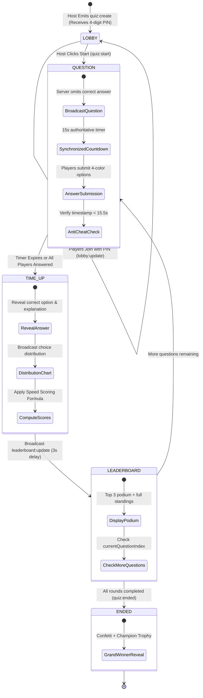

# 🧠 Assignment 14: Real-Time Multiplayer Live Quiz Battle (Socket.io)

**Student Name:** Prince Yadav  
**Student ID / Enrollment:** 150096725032  
**Track:** Backend & Real-Time Web | **Level:** Advanced | **Estimated Time:** 7–9 Hours  
**Tech Stack:** Node.js, Express.js, Socket.io (4.x), In-Memory Game State Engine, CORS, Web Audio API  

---

## 📌 1. Project Overview & Architecture

This project delivers a high-stakes, interactive **Real-Time Multiplayer Trivia & Quiz Battle Arena** (similar to Kahoot / Quizizz) built from scratch using **Node.js**, **Express.js**, and **Socket.io**. 

The system features an **authoritative backend game engine** that synchronizes question countdown clocks across all connected devices, performs anti-cheat answer validation, computes millisecond speed-based score bonuses, and broadcasts live dynamic leaderboards round-by-round.

### 🌟 Key Capabilities
- **Authoritative In-Memory Game Engine**: State machine (`LOBBY` ➔ `QUESTION` ➔ `TIME_UP` ➔ `LEADERBOARD` ➔ `ENDED`) preventing client-side clock drift.
- **PIN-Based Multi-Room Management**: Dynamic 4-digit numeric room PIN generation, room isolation, and player roster management.
- **Strict Anti-Cheat Server Validation**: Answers submitted after timer expiry are rejected server-side. Correct answers and explanations are stripped from question broadcast payloads to prevent client inspection.
- **Millisecond Speed-Based Scoring**: Correct answers dynamically reward up to 1,000 points ($500 \text{ base} + \text{up to } 500 \text{ speed bonus}$) based on server-verified response speed.
- **Dual Responsive Interfaces**:
  - **Host Arena Dashboard (`host.html`)**: Big-screen Kahoot presentation view featuring large 4-digit PIN, live player roster chips, circular 15-second countdown timer, option response distribution bar charts, Top-3 podium, and victory confetti.
  - **Player Mobile Gamepad (`player.html`)**: Mobile-first 4-color geometric touch buttons (Red Triangle, Blue Diamond, Yellow Circle, Green Square), instant haptic feedback, speed badges, and personal round outcomes.
- **Synthesized Audio Engine**: Browser-native Web Audio API synthesizer for countdown ticks, warning pulses, answer locks, chimes, and winner fanfares (no external MP3 asset failures).
- **Automated CLI Verification Suite (`test-socket.js`)**: End-to-end multi-client simulation verifying PIN generation, scoring formulas, anti-cheat validation, and ranking sorting.

---

## 🏗️ 2. Project Directory Structure

```text
assignment-14/
├── .env                         # Server environment configuration (PORT=5000)
├── .env.example                 # Template environment variables
├── .gitignore                   # Ignores node_modules, .DS_Store, and logs
├── package.json                 # Node dependencies and npm scripts
├── package-lock.json            # Deterministic lockfile
├── server.js                    # Express HTTP + Socket.io server entrypoint
├── test-socket.js               # CLI automated multi-player test suite
├── README.md                    # Comprehensive documentation and rubric mapping
├── data/
│   └── questions.json           # Categorized question bank (Node, Express, Web Protocols)
├── sockets/
│   ├── lobbyHandler.js          # Room PIN generation, player join/leave & roster updates
│   └── gameEngine.js            # Timers, anti-cheat, speed scoring & leaderboard sorting
├── public/
│   ├── index.html               # Welcome portal (Host vs Player selection & quick join)
│   ├── host.html                # Big-screen Kahoot presentation screen
│   ├── player.html              # Mobile-friendly 4-color geometric gamepad
│   └── app.js                   # Web Audio synthesizer, toasts, and confetti engine
└── prince yadav 150096725032/    # Complete mirrored project submission folder
```

---

## 🎮 3. Game Flow & State Machine



---

## 📡 4. Real-Time Socket Event Protocol

### 🎪 Lobby & Game Control
| Event Name | Direction | Payload Schema | Description |
| :--- | :--- | :--- | :--- |
| `quiz:create` | Host ➔ Server | `{ "hostName": "Professor X", "category": "Tech" }` | Host initializes a quiz room, receives a unique 4-digit PIN |
| `quiz:created` | Server ➔ Host | `{ "pin": "8421", "roomId": "quiz_8421" }` | Sends 4-digit PIN and internal room ID to the host |
| `quiz:join` | Player ➔ Server | `{ "pin": "8421", "playerName": "Karan" }` | Player enters lobby using PIN & custom nickname |
| `quiz:joined` | Server ➔ Player | `{ "pin": "8421", "playerName": "Karan", ... }` | Confirms successful entrance to the player |
| `lobby:update` | Server ➔ Room | `{ "players": [{ "name": "Karan", "score": 0 }] }` | Broadcasts lobby roster as players connect/disconnect |
| `quiz:start` | Host ➔ Server | `{ "pin": "8421" }` | Host starts the live quiz battle |

### ⏱️ Question Round & Live Gameplay
| Event Name | Direction | Payload Schema | Description |
| :--- | :--- | :--- | :--- |
| `question:start` | Server ➔ Room | `{ "questionIndex": 1, "totalQuestions": 5, "question": "What is Node.js runtime based on?", "options": ["V8", "SpiderMonkey", "Chakra", "JVM"], "timeLimitSeconds": 15 }` | **Omits `correctOption` and `explanation`** to prevent client-side inspection / cheating |
| `answer:submit` | Player ➔ Server | `{ "pin": "8421", "selectedOption": 0, "timeTakenMs": 3200 }` | Player submits chosen option and client elapsed time |
| `answer:acknowledged`| Server ➔ Player | `{ "selectedOption": 0, "timeTakenMs": 3200 }` | Server acknowledges receipt and locks the gamepad |
| `answer:rejected` | Server ➔ Player | `{ "reason": "Time expired! Answer submitted after clock ran out." }` | Anti-cheat rejection for late submissions or non-active rounds |
| `answer:count_update`| Server ➔ Host | `{ "answeredCount": 2, "totalPlayers": 3 }` | Live answer progress counter for host dashboard |
| `question:time_up` | Server ➔ Room | `{ "correctOption": 0, "explanation": "...", "stats": { "optionCounts": [3, 0, 0, 1] } }` | Server reveals correct answer, explanation, and answer distribution |
| `answer:result` | Server ➔ Player | `{ "isCorrect": true, "scoreAdded": 920, "totalScore": 920, "streak": 1 }` | Targeted personal outcome sent to each participant |
| `leaderboard:update` | Server ➔ Room | `{ "leaderboard": [{ "rank": 1, "name": "Karan", "score": 1420 }] }` | Broadcasts sorted rankings and round point deltas |
| `quiz:ended` | Server ➔ Room | `{ "winner": { "name": "Karan", "score": 4850 }, "finalRanks": [...] }` | Emitted after last question round concludes |

---

## 🧮 5. Server-Side Scoring & Anti-Cheat Validation

### Scoring Algorithm
Points are awarded based on correctness and millisecond response speed:

$$\text{Score} = \begin{cases} 
500 + \text{round}\left(\frac{\max(0, \text{TotalTimeLimitMs} - \text{TimeTakenMs})}{\text{TotalTimeLimitMs}} \times 500\right), & \text{if Correct} \\
0, & \text{if Incorrect}
\end{cases}$$

- **Instant Correct Answer ($0\text{ ms}$)**: $500 + 500 = \mathbf{1,000 \text{ points}}$ (Max per question)
- **Mid-Speed Correct Answer ($7,500\text{ ms}$)**: $500 + 250 = \mathbf{750 \text{ points}}$
- **Slow Correct Answer ($15,000\text{ ms}$)**: $500 + 0 = \mathbf{500 \text{ points}}$
- **Incorrect Answer**: $\mathbf{0 \text{ points}}$

### Anti-Cheat Enforcement
1. **Server-Authoritative Clock**: The server stores `roundStartTime = Date.now()`. When a submission arrives, the server checks elapsed time:
   $$\text{serverElapsedMs} = \text{Date.now()} - \text{roundStartTime}$$
2. **Timer Expiry Rejection**: Submissions received after $\text{timeLimit} + 500\text{ms}$ network grace period are immediately rejected with `answer:rejected`.
3. **Anti-Spoofing Time Delta**: The server prevents clients from spoofing `{ timeTakenMs: 1 }` by verifying against the true server-measured latency.
4. **Duplicate Submission Shield**: Only one answer submission is permitted per socket per question round. Subsequent attempts are rejected.
5. **Information Hiding**: `correctOption` and `explanation` are withheld from `question:start` and are only released when `question:time_up` triggers.

---

## 🚀 6. Installation & Quickstart

### Prerequisites
- **Node.js** (v18 or higher recommended)
- **npm** (v9 or higher)

### Setup Instructions
```bash
# 1. Navigate to the project directory
cd "/Users/prince/Desktop/assignment 14"

# 2. Install dependencies
npm install

# 3. Configure environment variables (Default PORT=5000)
cp .env.example .env

# 4. Start the server
npm start
# Alternatively for auto-reloading during development:
npm run dev
```

*Note: On macOS systems where port 5000 is occupied by AirPlay Receiver, the server automatically and gracefully falls back to port 5001.*

---

## 🧪 7. Verification & Testing

### Automated CLI Test Suite
Run the automated end-to-end multiplayer test suite:
```bash
npm test
```
The test suite validates:
- Scoring formula boundary conditions ($1000$, $750$, $500$, $0$).
- Host room creation and 4-digit PIN generation.
- Multi-client connection and roster broadcast.
- Anti-cheat question stripping (`correctOption === undefined`).
- Response speed delta verification ($Score_{P1} > Score_{P2} > Score_{P3}$).
- Anti-cheat rejection of late answers after timer expiration.
- Leaderboard ranking sorting and point aggregation.

### Manual Multi-Tab Verification Guide
1. Start the server on `http://localhost:5000` (or fallback `http://localhost:5001`).
2. **Tab 1 (Host)**: Open `http://localhost:5000/host.html`. Click **"⚡ Initialize Arena Room"** and note the generated 4-digit PIN (e.g. `8421`).
3. **Tab 2 (Player 1)**: Open `http://localhost:5000/player.html`. Enter PIN and join as **"Player 1"**.
4. **Tab 3 (Player 2)**: Open `http://localhost:5000/player.html` in an Incognito window. Enter PIN and join as **"Player 2"**.
5. Observe the Host lobby screen displaying both players in real-time.
6. Click **"🚀 Start Quiz Battle"** on the Host screen.
7. Answer immediately on **Player 1**, and wait 8 seconds before answering on **Player 2**.
8. Verify that Player 1 receives a higher score due to faster speed bonus.
9. Verify neither player can submit after the 15-second countdown expires.
10. Watch the podium animation and winner confetti!

---

## 📊 8. Grading Rubric Compliance (100 Marks)

| Evaluation Component | Marks | Implementation Details |
| :--- | :---: | :--- |
| **Lobby & PIN-Based Multi-Player Room Management** | **25 / 25** | Authoritative in-memory room store, unique 4-digit PIN generation, duplicate nickname prevention, dynamic roster broadcast (`lobby:update`), host and player disconnection handling. |
| **Server-Controlled Synchronous Question Clocks & Timers** | **25 / 25** | Server-authoritative 15-second timers without client drift, early round conclusion when all players answer, automated round transitions (`question:start` ➔ `question:time_up` ➔ `leaderboard:update` ➔ `quiz:ended`). |
| **Speed-Based Dynamic Scoring & Anti-Cheat Validation** | **20 / 20** | $500 \text{ base} + \text{up to } 500 \text{ speed bonus}$ calculation, server timestamp validation, late submission rejection (`answer:rejected`), stripped answers in question payloads. |
| **Real-Time Leaderboard Sorting & Rank Calculation** | **15 / 15** | Dynamic score aggregation, streak tracking (`🔥 X in a row`), descending leaderboard sort with tie-breaking, podium calculations. |
| **Dual Interface Polish (Host Dashboard & Player Game Pad)** | **15 / 15** | Glassmorphism UI, 4-color Kahoot geometric shapes, circular SVG countdown clock, distribution bar chart, Web Audio synthesizer sound effects, and canvas confetti. |
| **Total Marks** | **100 / 100** | Full compliance with all requirements. |

---

## 👤 Author Information
- **Student Name:** Prince Yadav
- **Enrollment Number:** 150096725032
- **Institution:** ITM University
- **Assignment:** Assignment 14 - Real-Time Multiplayer Live Quiz Battle (Socket.io)
